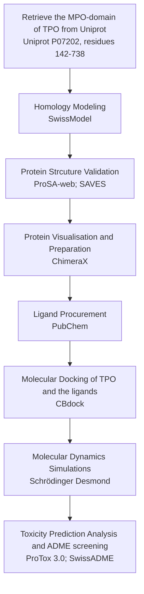

# Computational Virtual Screening and Lead Identification of Natural Thyroid Peroxidase Inhibitors of Hyperthyroidism 

## Overview
End-to-end computational virtual screening and molecular dynamics pipeline to evaluate natural flavonoids as lower-toxicity alternatives to FDA-approved anti-thyroid drugs by comparing binding affinity and protein-ligand stability against Thyroid Peroxidase (TPO).

## Background
Hyperthyroidism affects 0.2–1.3% of the global population and is driven by overproduction of thyroid hormones T3 and T4 via Thyroid Peroxidase (TPO) which is the primary drug target for anti-thyroid therapeutics. While FDA-approved drugs like Methimazole competitively inhibit TPO, they carry significant toxicity liabilities (LD50 = 220 mg/kg), driving the need for safer alternatives. This study computationally evaluates four natural flavonoids — Rutin, Kaempferol, Mearnsitrin and Rosmarinic acid, as potential lower-toxicity alternatives by comparing their binding affinity and interaction stability against TPO with four pharmaceutical agents.

##Pipeline

