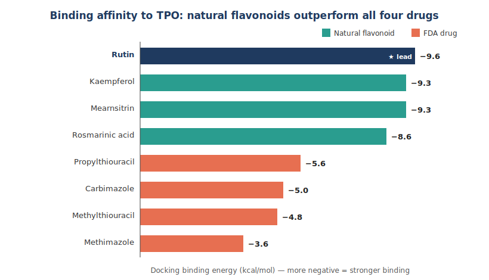
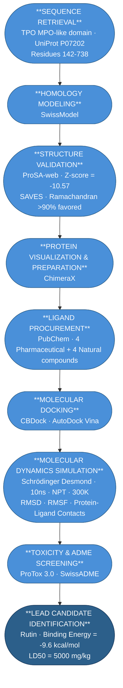
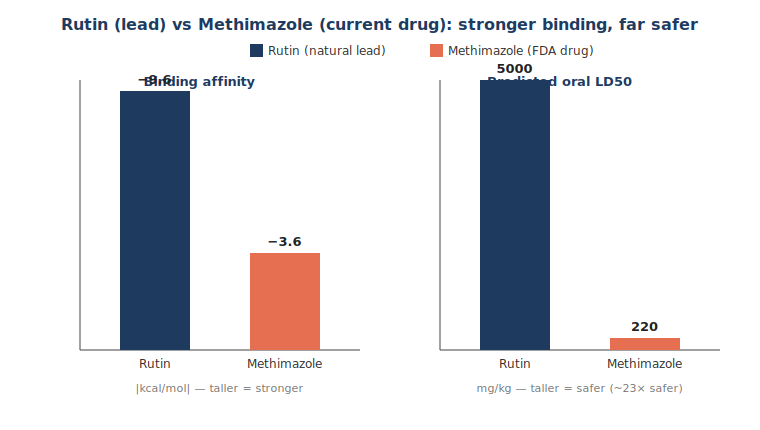

# Computational Virtual Screening and Lead Identification of Natural Thyroid Peroxidase Inhibitors for Hyperthyroidism


## Overview

End-to-end computational virtual screening and molecular dynamics pipeline that evaluates natural flavonoids as **lower-toxicity alternatives to FDA-approved anti-thyroid drugs**, by comparing binding affinity and protein–ligand stability against **Thyroid Peroxidase (TPO)**.

---

## Key Result

All four screened **natural flavonoids bound TPO 2–3× more strongly** than all four FDA-approved anti-thyroid drugs. **Rutin** emerged as the lead candidate — the strongest binder (**−9.6 kcal/mol** vs −3.6 for Methimazole), a stable complex across a 10 ns MD simulation (RMSD ≈ 3 Å), and a far safer predicted toxicity profile (**LD50 5000 vs 220 mg/kg**, ~23× safer).



---

## Background

Hyperthyroidism affects 0.2–1.3% of the global population and is driven by overproduction of thyroid hormones T3 and T4 via **Thyroid Peroxidase (TPO)**, the primary drug target for anti-thyroid therapeutics. FDA-approved drugs such as Methimazole competitively inhibit TPO but carry significant toxicity liabilities (Methimazole LD50 = 220 mg/kg), motivating the search for safer alternatives. This study computationally evaluates four natural flavonoids — **Rutin, Kaempferol, Mearnsitrin, and Rosmarinic acid** — against four pharmaceutical agents, comparing binding affinity and interaction stability with TPO.

## Pipeline



## Methods

1. **Target preparation** — the TPO MPO-like catalytic domain (UniProt **P07202**, residues 142–738) was modeled by homology with **SwissModel**.
2. **Structure validation** — the model passed quality checks via **ProSA-web** (Z-score = −10.57, within the range of experimentally determined structures of comparable size) and **SAVES/Ramachandran** analysis (>90% residues in favored regions). Prepared and visualized in **ChimeraX**.
3. **Ligand set** — eight ligands retrieved from **PubChem**: four anti-thyroid drugs (Methimazole, Methylthiouracil, Carbimazole, Propylthiouracil) and four natural flavonoids (Rutin, Kaempferol, Mearnsitrin, Rosmarinic acid).
4. **Molecular docking** — blind docking with **CB-Dock / AutoDock Vina**; for each ligand the highest-affinity pose across all detected cavities was retained.
5. **Molecular dynamics** — the top complexes were simulated in **Schrödinger Desmond** (10 ns, NPT ensemble, 300 K), profiling **RMSD, RMSF, and protein–ligand contacts** for stability.
6. **ADMET screening** — predicted toxicity and drug-likeness via **ProTox 3.0** and **SwissADME**.

## Results

| Ligand | Class | Binding energy (kcal/mol) |
|--------|-------|:--------------------------:|
| **Rutin** | Natural flavonoid | **−9.6** |
| Kaempferol | Natural flavonoid | −9.3 |
| Mearnsitrin | Natural flavonoid | −9.3 |
| Rosmarinic acid | Natural flavonoid | −8.6 |
| Propylthiouracil | FDA drug | −5.6 |
| Carbimazole | FDA drug | −5.0 |
| Methylthiouracil | FDA drug | −4.8 |
| Methimazole | FDA drug | −3.6 |

The separation is striking: every natural compound (−8.6 to −9.6) outbinds every drug (−3.6 to −5.6). Rutin not only binds most strongly but is also dramatically safer than the current standard drug:



## Key Findings

- **Natural flavonoids are stronger TPO binders** than all four FDA-approved anti-thyroid drugs in silico.
- **Rutin is the lead candidate** — best binding affinity (−9.6 kcal/mol), a stable protein–ligand complex over 10 ns MD (RMSD ≈ 3 Å), and a far more favorable predicted safety profile (LD50 5000 vs 220 mg/kg).
- Results provide a computational rationale for experimentally investigating flavonoids — Rutin in particular — as **low-toxicity TPO inhibitor leads**.

> **Scope & limitations.** This is a computational (in silico) study; binding energies and toxicity are predictions from docking and QSAR-based tools, not experimental measurements. The findings are hypothesis-generating and would require in vitro/in vivo validation.

## Repository Structure

```
TPO-Virtual-Screening-Computational-Drug-Discovery/
│
├── 01_TPO_protein_structure/     # Homology model of the TPO MPO-like domain
├── 02_TPO_structure_validation/  # ProSA-web & SAVES/Ramachandran validation
├── 03_Ligands/                   # 8 ligand structures (4 drugs, 4 flavonoids)
├── 04_Docking results/           # Docked TPO–ligand complexes (.pdb), best pose per ligand
├── 05_MD simulations/            # Desmond 10 ns trajectories & RMSD/RMSF analysis
├── 06_Toxicity Analysis/         # ProTox 3.0 ADMET reports per ligand
├── tpo_fig1_binding.svg          # README figures
├── tpo_fig2_rutin_vs_drug.svg
├── LICENSE
└── README.md
```

## Tools & Technologies

| Stage | Tools |
|-------|-------|
| Homology modeling | SwissModel |
| Structure validation | ProSA-web, SAVES (Ramachandran) |
| Visualization & prep | ChimeraX, PyMOL |
| Docking | CB-Dock, AutoDock Vina |
| Molecular dynamics | Schrödinger Desmond |
| ADMET | ProTox 3.0, SwissADME |
| Databases | UniProt, PubChem |

## Skills Demonstrated

Structure-based drug discovery · homology modeling & model validation · molecular docking · molecular dynamics simulation (RMSD/RMSF, protein–ligand contacts) · ADMET/toxicity prediction · structural bioinformatics workflows · scientific interpretation and reporting.

## Author

**Gautami Deshpande** — bioinformatics & computational structural biology.

*Released under the MIT License.*
